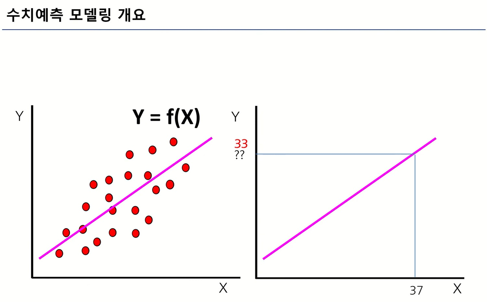

# ML 1주차 정규과제

📌ML 정규과제는 매주 정해진 **유튜브 강의 영상을 통해 머신러닝 이론을 학습**한 후, 해당 내용을 바탕으로 **실습 문제를 풀어보며 이해도를 높이는 학습 방식**입니다. 

이번주는 아래의 **ML_1st_TIL**에 명시된 유튜브 강의를 먼저 수강해 주세요. 학습 중에는 주요 개념을 스스로 정리하고, 이해가 어려운 부분은 강의 자료나 추가 자료를 참고해 보완해주세요. 과제까지 다 작성한 이후에 Github를 과제 시트에 제출해주시면 됩니다.


**(수행 인증샷은 필수입니다.)** 

> 주어진 과제를 다 한 이후, 인증샷이나 따로 코드를 깃허브에 정리하여 제출해주세요.


## ML_1st_TIL

### 수치예측, 범주예측

### 머신러닝 모델 학습 프로세스

### 선형회귀모델 1 (개요, 모델가정)

### 선형회귀모델 2 (파라미터 추정, 최소제곱법)

<br>

<!-- TIL에서 나와있는 강의 사이에 있는 과제에 해당이 되지 않는 강의도 내용이 연속적으로 진행하기 때문에 수강하시면 이해하기 쉬우실 것입니다. -->


## 주차별 학습 (Study Schedule)

| 주차   | 공부 범위                              | 완료 여부 |
| ------ | -------------------------------------- | --------- |
| 1주차. | 선형 회귀 (Linear Regression) (1)      | ✅         |
| 2주차  | 선형 회귀 (Linear Regression) (2)      | 🍽️         |
| 3주차  | 로지스틱 회귀 (Logistic Regression)    | 🍽️         |
| 4주차  | 결정 트리 (Decision Tree)              | 🍽️         |
| 5주차  | 앙상블 : 랜덤 포레스트 (Random Forest) | 🍽️         |
| 6주차  | 주성분 분석 (PCA)                      | 🍽️         |
| 7주차  | K - 평균 군집화                        | 🍽️         |

<!-- 여기까진 그대로 둬 주세요-->


---

# 1️⃣ 개념 정리

<!--“과제 내용 중 LaTeX 수식처럼 Git에 직접 정리하기 어려운 부분은 아이패드나 종이에 손으로 작성한 뒤 파일(이미지/PDF 등)로 첨부하여 인증해도 됩니다.” -->

## 00. 머신러닝 및 인공지능 개요

- Machine learning<br>: 인간이 개발한 알고리즘을 컴퓨터 언어를 통해 기계에게 학습시키는 행위
- 다변량 데이터의 예시<br>
- 학습 데이터와 검증 데이터
  - 학습 데이터: 모델 f(X) 구축 시 사용되는 데이터
  - 검증 데이터: 구축된 모델을 검증하는 데 사용되는 데이터
  - 주어진 데이터의 일부를 학습 데이터로, 일부를 검증 데이터로 분할하여 모델을 구축하고 검증함.
  - 이때 검증 데이터에도 실제로는 타겟 변수의 값이 존재하나, 이를 없다고 가정한 후에 모델을 적용한 타겟 변수 값과 비교하여 모델의 성능을 평가할 수 있음.
- 이러한 함수를 찾는 과정이 Machine Learning이며, 이것이 어떤 실체에 들어가면 인공지능이 되는 것.
- 딥러닝이 각광받는 이유?<br>: 기존의 알고리즘에 비해, 데이터의 수가 늘어날수록 성능이 비례하여 증가함. <br>


## 01. 수치해석, 범주예측

```
✅ 학습 목표 :
* 수치예측과 범주예측의 차이를 이해할 수 있다.
* 다변량 데이터의 개념을 이해할 수 있다. 
* 예측 모델링의 목적을 강의에서 제시한 예시를 통해서 파악할 수 있다. 
```
### 1-1. 수치예측과 범주예측의 차이
- 에측하는 종속변수의 유형에 따른 분류
  | 연속형  | 범주형 |
  |-------|------|
  | 수치예측 | 범주예측   |

- 예측 모델링 개요<br><br>

- 범주예측 예제<br>

### 1-2. 예측 모델링의 목적
  | 목적         | 한줄 설명                             | 예시                              |
  | ---------- | --------------------------------- | ------------------------------- |
  | 값/라벨 예측    | 미지의 **수치(회귀)**·\*\*범주(분류)\*\*를 추정 | 매출/가격 예측, 스팸/정상 분류              |
  | 의사결정 자동화   | 예측을 바탕으로 **승인·차단·검토**를 자동화        | 보험 사기 **차단 플래그**, 이메일 **자동 분류** |
  | 개인화·타게팅    | 사용자별 **맞춤 추천/오퍼**                 | 이탈 가능성 높은 고객 대상 쿠폰              |

<!-- 새롭게 배운 내용을 자유롭게 정리해주세요.-->

## 02. 머신러닝 모델 학습 프로세스

```
✅ 학습 목표 :
* 다변량 데이터에서 X와 Y의 관계를 이해할 수 있다.
* 머신러닝 모델이 파라미터(w1,w2 등)를 찾는 과정임을 이해할 수 있다.
* 비용함수 최소화를 통해 파라미터를 추정하는 원리를 이해할 수 있다. 
```

### 2-1. X와 Y의 관계
- X와 Y의 관계 개요
  - X와 Y의 관계를 찾는 것!
  - 우리의 주 관심은 Y(예측하려는 대상)
  - Y를 설명하는 X변수는 보통 여러 개 
  - 조합하는 방법은 선형, 비선형 등 무수히 많음.

- 머신러닝의 학습 프로세스
  <br>: 주어진 X와 Y의 관계들을 보고, 적절한 f(x)를 찾아가는 과정<br>

### 2-2. 파라미터를 찾는 과정
-  파라미터를 찾는 과정이란?
    - **파라미터(예: w₁, w₂, b)**: 데이터를 넣으면 **예측값을 만들어내는 숫자들**.
        - 선형회귀: ŷ = w₁x₁ + w₂x₂ + b
        - 로지스틱회귀/신경망도 결국 가중치·편향을 학습
    - **학습(Training)**: 파라미터를 임의값에서 시작해 **좋은 값으로 업데이트**하는 과정.
        - 데이터 → 예측 → 오차 계산 → 파라미터 조정(반복)
    - **하이퍼파라미터**(학습률, 트리 깊이 등)는 사람이 정하고, **파라미터**는 데이터로부터 **학습**됨.

### 2-3.  비용함수 최소화로 파라미터를 추정하는 원리
- **비용함수(손실, J(w))**: “예측이 얼마나 틀렸나”를 숫자로 표현.
  - 회귀: **MSE**(평균제곱오차)
  - 분류: **Cross-Entropy(로그손실)**
- **목표**: J(w)를 **최소화**하는 w\* 찾기 → 가장 잘 맞는 모델.
  -  **방법**: 경사하강법(Gradient Descent
    - 아이디어: 기울기(∇J)를 따라 **내려가듯** w를 갱신
    - 업데이트: **w ← w − η·∇J(w)** (η: 학습률)
    - 반복: 수렴하거나 검증 성능이 더 안 좋아지면 중지(Early Stopping 등)
    - **정규화(규제)**: J(w)에 페널티 추가(L1/L2) → 과적합 방지, 단순한 w 선호.

- 머신러닝 모델 학습 과정 요약
    1. 모델 결정하기(Y를 표현하기 위한 X들을 조합할 방식 결정)
    2. 모델을 구성하는 파라미터 찾기(모델의 핵심!)
        - 가지고 있는 데이터를 이용하여 실제 데이터의 값과 최대한 같게 나오도록!

<!-- 새롭게 배운 내용을 자유롭게 정리해주세요.-->

<!-- 강의에서 공식이 많이 나오는데 공식에 대한 이해보다는 (나중에 배울 예정) 학습 프로세스에 대한 개념 중심적으로 공부해주세요.-->


## 03. 선형회귀모델 1 (개요, 모델 가정)

```
✅ 학습 목표 :
* 선형회귀모델의 개념과 목적을 이해할 수 있다.
* 확정적 관계와 확률적 관계의 차이를 이해할 수 있다.
* 선형회귀모델의 가정과 파라미터 추정의 의미를 이해할 수 있다. 
```
### 3-1. 선형회귀모델의 개념과 목적
- 개념: 선형회귀모델 (Linear Regression)
  - **독립변수(X)** 와 **종속변수(Y)** 의 **선형 관계**를 추정하는 모델
  - 직선 형태의 식으로 데이터를 설명함
- 직관적 이해
  - X가 1 증가할 때 Y가 얼마나 변하는지 → **기울기**로 나타냄
  - 데이터 점들 사이를 가장 잘 통과하는 **최적의 직선**을 찾는 것

- 목적
  - X변수와 Y변수 사이의 관계를 수치로 설명
  - 미래의 반응변수 Y의 값을 예측

### 3-2. 확정적 관계와 확률적 관계의 차이
|관계 종류|특징|오차항 유무|
|---|---|---|
|확정적 관계|X 변수만으로 Y를 100% 표현 가능|오차항 없음|
|확률적 관계|X 변수와 오차항이 Y를 표현|오차항 있음|

### 3-3. 선형회귀모델의 가정과 파라미터 추정의 의미
> $Y_i = \beta_0 + \beta_1 X_i + \varepsilon_i$
- 핵심: 출력변수 Y를 입력변수 X들의 선형결합으로 표현한 모델<br>
- 분류<br>
- Y = X로부터 설명되는 부분 + 그렇지 않은 부분(확률오차)
- 확률오차에 대한 가정
  - 오차항은 정규분포를 따른다
  - 오차항들의 평균은 0이고, 오차항들의 분산은 정규분포를 따른다.


<!-- 새롭게 배운 내용을 자유롭게 정리해주세요.-->

## 04. 선형회귀모델 2 (파라미터 추정, 최소제곱법)

```
✅ 학습 목표 :
* 파라미터 추정의 목적과 과정(비용함수 최소화)을 이해할 수 있다.
* Least Square(최소제곱법)의 원리를 이해할 수 있다.
* 잔차(Residual)와 확률 오차(ε)의 차이를 구분할 수 있다. 
```

### 4-1. 파라미터 추정의 목적과 과정(비용함수 최소화)의 이해
- 파라미터 추정의 목적
  - **목적**: 데이터에 가장 잘 맞는 직선을 찾기
  - 즉, **예측값(ŷ)** 과 실제값(y)의 차이를 최소화하는 **β₀(절편), β₁(기울기)** 를 결정
- 과정: 최소제곱법, OLS

### 4-2. Least Square(최소제곱법)
- 직관적 이해
  - 데이터 점들과 직선 사이의 **세로 거리(잔차)** 를 가능한 작게 만드는 직선을 찾음
  - "가장 잘 맞는 직선" = **잔차제곱합이 최소가 되는 직선**
- 과정
  1. **모델식 세우기**

   $$
   Y = \beta_0 + \beta_1 X + \epsilon
   $$

  2. **예측값 계산**

   $$
   \hat{Y} = \beta_0 + \beta_1 X
   $$

  3. **잔차(오차) 정의**

   $$
   e_i = y_i - \hat{y}_i
   $$

  4. **목표 함수 설정 (잔차제곱합, RSS)**

   $$
   RSS = \sum (y_i - \hat{y}_i)^2
   $$

  5. **RSS 최소화 → 최적의 β₀, β₁ 찾기**

### 4-3. 잔차(Residual)과 확률 오차($ \varepsilon $)의 차이 구분
-  잔차 vs 확률오차

| 구분 | 확률오차 (Random Error, $\epsilon$)              | 잔차 (Residual, $e$)             |
| -- | -------------------------------------------- | ------------------------------ |
| 정의 | 실제값 $Y$ 와 **모델의 '진짜' 회귀식** 간의 차이             | 실제값 $Y$ 와 **추정된 회귀식(ŷ)** 간의 차이 |
| 수식 | $\epsilon_i = Y_i - (\beta_0 + \beta_1 X_i)$ | $e_i = Y_i - \hat{Y}_i$        |
| 성격 | **이론적 개념** (관찰 불가)                           | **관찰 가능** (데이터에서 계산 가능)        |
| 역할 | 데이터가 직선에서 벗어나는 **불확실성·잡음**                   | 모델 적합 결과의 **남은 오차**            |
| 평균 | 기대값: $E(\epsilon)=0$ (가정)                    | 표본에서 보통 평균 ≈ 0                 |


- 직관적 이해
  * **확률오차(ε)**: 세상에 "진짜 직선"이 있다고 가정했을 때, 그 직선에서 실제 데이터가 얼마나 벗어났는지 → **보이지 않는 진짜 오차**
  * **잔차(e)**: 우리가 데이터로 추정한 "근사 직선"에서 데이터가 얼마나 벗어났는지 → **실제로 계산 가능한 오차**
- 결론
  * **확률오차** = 원래 정답과의 차이 (우린 모름)
  * **잔차** = 내가 그린 추정 답안과 실제 값의 차이 (계산 가능)

<!-- 새롭게 배운 내용을 자유롭게 정리해주세요.-->


<br>
<br>

# 2️⃣ 과제

> **보스턴 주택 가격 데이터셋을 사용하여 주택 가격 예측 모델을 훈련 후, `model.coef_`값을 확인하고, 어떤 특성이 주택 가격에 가장 큰 부정적 / 부정적 영향을 미치는지 분석하여 설명하는 주피터 노트북을 작성하세요.** 

<!-- 주피터 노트북으로 작성한 경우, 깃허브에 해당 파일 링크를 올려 확인 가능하도록 권한을 설정하거나, 깃 레포지토리 내에 별도의 폴더를 만들어 함께 제출해도 됩니다. -->

~~~
과제 가이드
1. Boston Housing Dataset 소개
- sklearn.datasets.load_boston()으로 불러올 수 있는 데이터셋입니다. 
- 각 컬럼은 주택 가격에 영향을 줄 수 있는 다양한 특성을 나타냅니다. (예 : 평균 방 개수, 범죄율 등)

2. 선형회귀 모델 훈련
- sklearn.linear_model.LinearRegression( )을 사용해서 훈련할 수 있습니다.
- model.fit(X, y)를 사용하세요.

3. model.coef_ 해석 방법
- model.coef_ 는 각 특성(feature)의 계수(coefficient)를 의미합니다.
- 계수가 양수이면 그 특성이 클수록 주택 가격이 올라가는 것을 의미하고, 계수가 음수이면 그 특성이 클수록 주택 가격이 내려간다는 것을 의미합니다. 

4. 결과 분석 포인트
- model.coef_ 의 절댓값이 큰 변수가 가격에 더 큰 영향을 미칩니다. 
- 어떤 특성이 가장 긍정적인 영향을 미치고, 어떤 특성이 가장 부정적인 영향을 미치는지 찾아보세요.
- (X축 : 특성이름, Y축 : 계수 값) 을 사용하여 시각화를 사용해서 표현해도 좋습니다.

(참고) 깃허브 Machine-Learning Template 레포지토리의 base_code 폴더에 week1 과제를 수행하기 위한 기본 베이스 코드가 제공되니, 이를 참고해도 되고, 자유롭게 진행하셔도 됩니다.  
~~~


<br>

### 🎉 수고하셨습니다.