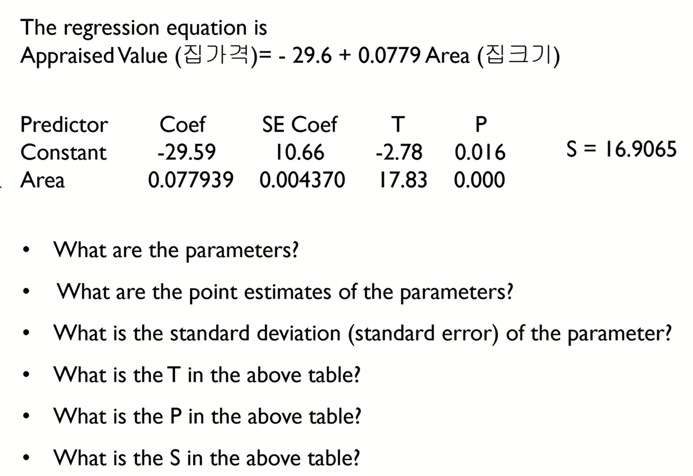
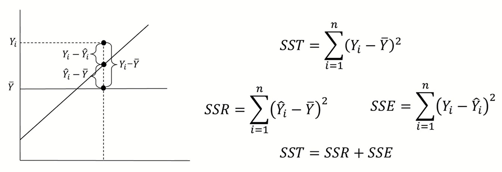

# ML 2주차 정규과제

📌ML 정규과제는 매주 정해진 **유튜브 강의 영상을 통해 머신러닝 이론을 학습**한 후, 해당 내용을 바탕으로 **실습 문제를 풀어보며 이해도를 높이는 학습 방식**입니다. 

이번주는 아래의 **ML_2nd_TIL**에 명시된 유튜브 강의를 먼저 수강해 주세요. 학습 중에는 주요 개념을 스스로 정리하고, 이해가 어려운 부분은 강의 자료나 추가 자료를 참고해 보완해주세요. 과제까지 다 작성한 이후에 Github를 과제 시트에 제출해주시면 됩니다.


**(수행 인증샷은 필수입니다.)** 

> 주어진 과제를 다 한 이후, 인증샷이나 따로 코드를 깃허브에 정리하여 제출해주세요.


## ML_2nd_TIL

### 선형회귀모델 3 (파라미터 구간추정, 가설 검정)

### 선형회귀모델 4 (R², ANOVA)

<br>


## 주차별 학습 (Study Schedule)

| 주차   | 공부 범위                              | 완료 여부 |
| ------ | -------------------------------------- | --------- |
| 1주차. | 선형 회귀 (Linear Regression) (1)      | ✅         |
| 2주차  | 선형 회귀 (Linear Regression) (2)      | ✅         |
| 3주차  | 로지스틱 회귀 (Logistic Regression)    | 🍽️         |
| 4주차  | 결정 트리 (Decision Tree)              | 🍽️         |
| 5주차  | 앙상블 : 랜덤 포레스트 (Random Forest) | 🍽️         |
| 6주차  | 주성분 분석 (PCA)                      | 🍽️         |
| 7주차  | K - 평균 군집화                        | 🍽️         |

<!-- 여기까진 그대로 둬 주세요-->

---

# 1️⃣ 개념 정리

## 01. 선형회귀모델 3 (파라미터 구간추정, 가설검정)

```
✅ 학습 목표 :
* 점추정(Point Estimation)과 구간 추정(Interval Estimation)의 차이를 이해할 수 있다. 
* BLUE(Best Linear Unbiased Estimator)의 의미와 필요성을 이해할 수 있다.
* 기울기에 대한 가설검정의 원리와 p-value 해석 방법을 이해할 수 있다. 
```

### 01-1. 점추정과 구간 추정의 차이
> $$
\hat{\beta}_0 = \bar{Y} - \hat{\beta}_1 \bar{X}, \quad 
\hat{\beta}_1 = \frac{\sum_{i=1}^n (X_i - \bar{X})(Y_i - \bar{Y})}{\sum_{i=1}^n (X_i - \bar{X})^2}
$$
- 파라미터 추정 알고리즘
  - Estimator(추정량): 샘플의 함수(a function of the samples) 
  - 추정량의 용도: 알려지지 않은 파라미터(${\beta}_0, {\beta}_1$)를 추정
  - 추정량의 종류
    1. 점추정(point estimator)
    1. 구간추정(interval estimator)

- 점추정(이미 배운 것)<br>
  1. ${\beta}_0$에 대한 점추정 식 $$
\hat{\beta}_0 = \bar{Y} - \hat{\beta}_1 \bar{X}$$
  1. ${\beta}_1$에 대한 점추정 식 $$\hat{\beta}_1 = \frac{\sum_{i=1}^n (X_i - \bar{X})(Y_i - \bar{Y})}{\sum_{i=1}^n (X_i - \bar{X})^2} $$
  1. ${\sigma}^2$에 대한 점추정 식 $$
\hat{\sigma}^2 = \left( \frac{1}{n-2} \right) \sum_{i=1}^n e_i^2 $$

- 구간추정
  - 구간으로 추정하여 보다 유연한 정보 제공
  - 파라미터에 대한 구간추정을 하기 위해서는 다음의 값들을 알고 있어야 함.
    1. 점 추정량
    1. 상수값
    1. 점 추정량에 대한 표준편차
  - 즉, 점 추정량에 대해서 상수값*표준편차 값을 빼고 더한 구간이 구간추정값임.

>$
\hat{\theta} - \text{상수값} \cdot \text{표준편차}(\hat{\theta}) 
\;\leq\; \theta \;\leq\; 
\hat{\theta} + \text{상수값} \cdot \text{표준편차}(\hat{\theta}) $<br>
$\hat{\theta} : \text{ point estimator of } \theta
$

- 구간추정 추정 실제 식
$$
\hat{\beta}_0 - t_{\alpha/2,\,n-2} \cdot sd\{\hat{\beta}_0\}
\;\leq\; \beta_0 \;\leq\;
\hat{\beta}_0 + t_{\alpha/2,\,n-2} \cdot sd\{\hat{\beta}_0\}
$$
1️⃣  
$$
\hat{\beta}_0 = \bar{Y} - \hat{\beta}_1 \bar{X} 
\quad : \; \beta_0 \text{의 point estimator}
$$

---

2️⃣  
$$
t_{\alpha/2,\,n-2} 
\quad : \; \text{유의수준 } (1-\alpha) \text{ 하에서 자유도가 } (n-2) \text{인 } t \text{ 분포의 값}
$$

---

3️⃣  
$$
sd\{\hat{\beta}_0\} 
= \sqrt{ \hat{\sigma}^2 
\left[ \frac{1}{n} + \frac{\bar{X}^2}{\sum_{i=1}^n (X_i - \bar{X})^2} \right] }
\quad : \; \hat{\beta}_0 \text{의 표준편차}
$$


### 01-2. BLUE(Best Linear Unbiased Estimator)의 의미와 필요성
- 최소제곱법 추정량 성질 <br> Gauss-Markov Theorem: Least Square estimator is the **b**est **l**inear **u**nbiased **e**stimator(**BLUE**)
- BLUE: The BLUE
  - is unbiased estimator 
  - has the smallest average squared error(variance) compared to any unbiased estimators<br> (다른 불편추정량 값에 비해서 가장 작은 분산 값을 가지고 있다.)


### 01-3. 기울기에 대한 가설검정의 원리, p-value 해석 방법

$$
H_0: \beta_1 = 0 \quad \text{vs.} \quad H_1: \beta_1 \neq 0
$$

$$
t^* = \frac{\hat{\beta}_1 - 0}{sd\{\hat{\beta}_1\}}
$$

&ensp;If $|t^*| > t_{\alpha/2,\,n-2}$, we reject $H_0$

$$
\text{P-value} = 2 \cdot P\left( T > |t^*| \right) \quad \text{where } T \sim t(n-2)
$$


- 기울기에 대한 가설검정
  - 알려지지 않은 파라미터에 대한 가설을 세우고 이를 검정
  - 일정오류 ${\alpha}$하에서 **기울기가 0인지 아닌지** 검정 

- 검정통계량<br>: 귀무가설이 참이라는 가정 하에, 이론값보다 크다면 귀무가설을 기각할 수 있게 됨.

- p-value<br>: 일반적으로 0.05, 0.01보다 작으면 검정통계량 값이 크다, 즉 귀무가설을 기각 가능하다는 뜻.

### 01-4. 예제


- What are the parameters?<br>${\beta}_0$, &nbsp; ${\beta}_1$($x$,&nbsp; $y$가 하나씩이므로)

- What are the point estimate of the parameters?<br> $ {\hat{\beta}_0} $ = -29.59, &nbsp; $ {\hat{\beta}_1} $ = 0.077939
  - Least Square estimation으로 구한 것.(점추정)

- What is the standard deviation of the parameter?<br>
$ sd \left( {\hat{\beta}_0} \right) $ = 10.66, &nbsp; $ sd \left({\hat{\beta}_1} \right) $ = 0.004370
- What is the T in the above table?<br>
 T= 17.83
- What is the P in the above table?<br> P = P-value = 0.000
- What is the S in the above table?<br> S = 16.9065

- 결론: ${{\beta}_1} $이 0이 아니다. 즉, 집 크기(X)는 집 가격(Y)에 유의미한 영향이 있다. 

<!-- 새롭게 배운 내용을 자유롭게 정리해주세요.-->


## 02.선형회귀모델 4 (R²) ANOVA)

```
✅ 학습 목표 :
* 결정계수(R²)와 수정 결정계수(Adjusted R²)의 의미와 차이를 이해할 수 있다.
* 결정계수를 통해 회귀모델의 설명력을 해석할 수 있다. 
* ANOVA(분산분석)의 개념과 회귀모델에서의 활용 방법을 이해할 수 있다. 
```
### 02-1. 결정계수와 수정결정계수의 의미와 차이


- 결정계수$ \left( R^2 \right) $
  -  $ R^2  $는 0과 1 사이에 존재
  - $ R^2  $=1: 현재 가지고 있는 X변수로 Y를 100% 설명 가능.
  - $ R^2  $ =0: 현재 가지고 있는 X변수는 Y설명(예측)에 전혀 도움이 되지 않는다.
  - X정보를 사용함으로써 단순히 Y의 평균값을 사용했을 때 대비 얻는 성능향상 정도
$$
R^2 = \frac{SSR}{SST} = 1 - \frac{SSE}{SST}
$$

- 수정 결정계수(Adjusted $ R^2  $)
  - $ R^2  $는 유의하지 않은 변수가 추가되어도 항상 증가하는 경향이 있음
  - 수정$ R^2  $는 앞에 특정 계수를 곱해 줌으로써(보정) 유의하지 않은 변수가 추가 될 경우 증가하지 않도록 함.
  - 설명변수가 서로 다른 회귀모형의 설명력을 비교할 때 사용
$$
R^2_{adj} = 1 - \left[ \frac{n-1}{\,n-(p+1)\,} \right] \frac{SSE}{SST}
$$
$$ R^2_{adj} \leq R^2 $$

### 02-3. ANOVA(분산분석)의 개념과 회귀모델에서의 활용방법
- 선형회귀분석에서만 사용하는 방법은 아님
- 분산분석: Analysis of Variance
  - 분산 정보를 이용하여 분석
  - 궁극적으로 가설검정을 행하는 용도로 사용됨
$$
SST = \sum_{i=1}^n (Y_i - \bar{Y})^2 \quad : \; Y \text{의 총 변동량}
$$

$$
SSR = \sum_{i=1}^n (\hat{Y}_i - \bar{Y})^2 \quad : \; X \text{변수에 의해 설명된 양}
$$

$$
SSE = \sum_{i=1}^n (Y_i - \hat{Y}_i)^2 \quad : \; \text{에러에 의해 설명된 양}
$$

1. $\frac{SSE}{SST} > 1 $<br> X변수에 의해 설명된 양 > 에러에 의해 설명된 양<br>X변수의 계수(기울기)가 0이 아님.

1. $0 \leq \frac{SSE}{SST} \leq 1 $ <br>X변수에 의해 설명된 양 < 에러에 의해 설명된 양<br>X변수의 계수(기울기)가 0이라고 할 수 있음.

- $\frac{SSR}{SSE} $ 얼마나 커야 큰 값인지?

---

### 📊 ANOVA(분산분석)의 의미

* **분산을 나눠서(Analysis of Variance)** 모델이 데이터를 얼마나 잘 설명하는지 평가하는 방법
* 전체 변동을 두 부분으로 나눔:

  $$
  총제곱합(SST) = 회귀제곱합(SSR) + 잔차제곱합(SSE)
  $$

---

#### ⚡ 효과 (왜 중요한가?)

1. **모델 유의성 검정**

   * 회귀모형이 "아무 의미 없는 직선(수평선)"보다 더 잘 설명하는지 확인
   * **F-검정(F-test)** 으로 수행

2. **설명력 분리**

   * **SSR**: 독립변수가 설명하는 부분
   * **SSE**: 여전히 설명 못한 오차 부분

3. **의사결정 근거**

   * p-value가 작으면 → 회귀모형이 유의미하다 ✅
   * 크면 → 설명력이 없다 ❌

---

#### 🔄 수행 과정 (언제 하는가?)

1. **모델 추정 후**

   * 최소제곱법으로 β 계수들을 먼저 구함
2. **변동 분해**

   * SST, SSR, SSE 계산
3. **F-통계량 계산**

   $$
   F = \frac{(SSR / k)}{(SSE / (n-k-1))}
   $$

   * k: 독립변수 개수, n: 표본 크기
4. **모형 유의성 판단**

   * F-분포 기준 → p-value 확인

---

#### 💡 필요성

* 단순히 **계수의 값**만 보는 게 아니라,
* "전체 모델이 통계적으로 유의미한가?"를 **검증하는 관문** 역할
* 즉, **회귀식 자체가 신뢰할 만한지** 확인하는 필수 단계

---

👉 정리하면,
ANOVA는 **전체 변동을 분리**해서 "회귀모형이 쓸모 있는가?"를 F-검정으로 확인하는 절차이며, **회귀계수를 해석하기 전에 반드시 거쳐야 하는 단계**입니다.

### 📌 ANOVA(분산분석)이 사용되는 경우

1. **회귀분석(Regression)**

   * 전체 변동을 **설명된 부분(SSR)** 과 **잔차(SSE)** 로 나눠서
   * 회귀모형이 유의한지 검증 (F-test)
     → **회귀모형 적합성 검정** 용도로 사용 ✅

2. **집단 간 평균 비교(고전적 ANOVA)**

   * 독립변수(요인, factor)가 **범주형**일 때,
   * 여러 집단의 평균 차이가 통계적으로 유의한지 확인
     → 예: 세 가지 교육방법(A, B, C)에 따른 시험 점수 차이 검증

---

#### 🎯 정리

* ANOVA는 **회귀모델에서만 쓰는 검정은 아님**
* 다만, **회귀분석 안에서도 "모델 전체 유의성 검정"** 을 위해 꼭 들어가는 단계
* 통계학적으로는 **"분산을 쪼개서 설명력을 평가한다"** 는 동일한 아이디어를 두 맥락(회귀 / 집단비교)에서 활용하는 것


<!-- 새롭게 배운 내용을 자유롭게 정리해주세요.-->


<br>
<br>

---

# 2️⃣ 과제

> **1주차에 만든 모델에 대해 `statsmodels`라이브러리를 사용하여 회귀분석 리포트를 출력합시다. 각 변수의 p-value를 확인하고 유의미한 변수와 그렇지 않은 변수를 구분합니다. 모델의 R-squared와 Adj.R-squared 값을 해석하고, 이 모델이 데이터를 얼마나 잘 설명하는지 자신의 생각을 주피터 노트북에 작성하세요**


~~~
과제 가이드
1. statsmodels를 사용한 회귀모델 생성
- import statsmodels.api as sm 을 사용하세요
- X 변수에 상수항을 추가하세요 (sm.add_constatnt(X))
- OLS(최고 제곱법) 모델로 적합합니다.

2. 리포트 출력 및 해석 
- print(model.summary())
- 출력되는 summary 에서 아래 항목을 중심으로 해석하세요:
* 각 변수의 p-value
* R-squared / Adj. R-squared


(참고) 깃허브 Machine-Learning Template 레포지토리의 base_code 폴더에 week2 과제를 수행하기 위한 기본 베이스 코드가 제공되니, 이를 참고해도 되고, 자유롭게 진행하셔도 됩니다.  
~~~


<br>

### 🎉 수고하셨습니다.