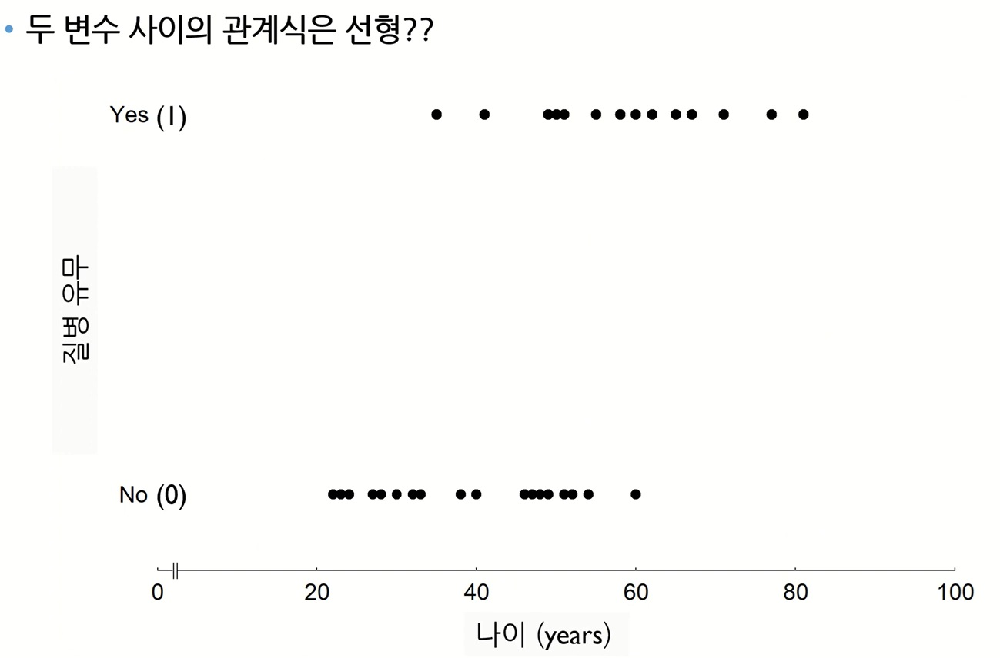
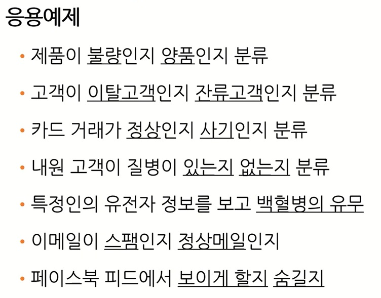
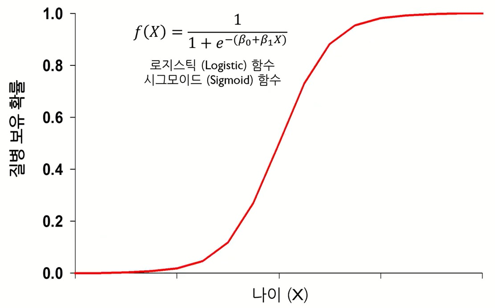
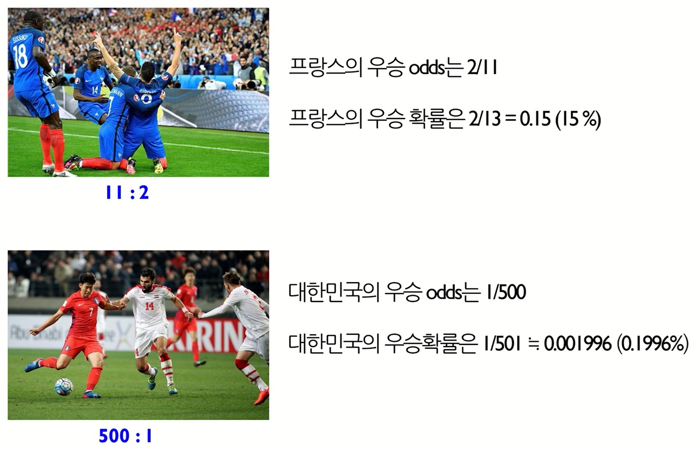

# ML 3주차 정규과제

📌ML 정규과제는 매주 정해진 **유튜브 강의 영상을 통해 머신러닝 이론을 학습**한 후, 해당 내용을 바탕으로 **실습 문제를 풀어보며 이해도를 높이는 학습 방식**입니다. 

이번주는 아래의 **ML_3rd_TIL**에 명시된 유튜브 강의를 먼저 수강해 주세요. 학습 중에는 주요 개념을 스스로 정리하고, 이해가 어려운 부분은 강의 자료나 추가 자료를 참고해 보완해주세요. 과제까지 다 작성한 이후에 Github를 과제 시트에 제출해주시면 됩니다.


**(수행 인증샷은 필수입니다.)** 

> 주어진 과제를 다 한 이후, 인증샷이나 따로 코드를 깃허브에 정리하여 제출해주세요.


## ML_3rd_TIL

### 로지스틱 회귀모델 1 (로지스틱 함수, 승산)

### 로지스틱 회귀모델 2 (파라미터 추정, 해석)

<br>


## 주차별 학습 (Study Schedule)

| 주차   | 공부 범위                              | 완료 여부 |
| ------ | -------------------------------------- | --------- |
| 1주차. | 선형 회귀 (Linear Regression) (1)      | ✅         |
| 2주차  | 선형 회귀 (Linear Regression) (2)      | ✅         |
| 3주차  | 로지스틱 회귀 (Logistic Regression)    | ✅         |
| 4주차  | 결정 트리 (Decision Tree)              | 🍽️         |
| 5주차  | 앙상블 : 랜덤 포레스트 (Random Forest) | 🍽️         |
| 6주차  | 주성분 분석 (PCA)                      | 🍽️         |
| 7주차  | K - 평균 군집화                        | 🍽️         |

<!-- 여기까진 그대로 둬 주세요-->


---

# 1️⃣ 개념 정리

## 01. 로지스틱 회귀모델 1 (로지스틱 함수, 승산)

```
✅ 학습 목표 :
* 로지스틱 회귀모델이 필요한 이유와 적용 상황을 이해할 수 있다.
* 로지스틱 함수(시그모이드 함수)의 특징과 역할을 설명할 수 있다.
* Odds(승산)의 개념과 로짓 변환을 통해 선형 모델로 바꾸는 원리를 이해할 수 있다. 
```

### 01-1. 로지스틱 회귀모델 배경


- 범주형 종속변수
  - 이진변수(종속변수 값 0 or 1)
  - 멀티변수(종속변수 값 1 or 2 or 3 이상)

-> 선형회귀모델과는 다른 방식으로 접근해야 할 필요성

- 새로운 관측치가 왔을 때 이를 기존 범주 중 하나로 예측(범주 예측)(=분류)<br>

### 01-2. 로지스틱 회귀모델 형태

$$ 
Y_i = \beta_0 + \beta_1 X_i + \varepsilon_i \quad,\quad Y_i = 0 \;\text{or}\; 1
$$

: y값이 연속형이 아닌, 0 아니면 1인 경우
$$
E(Y_i) = \beta_0 + \beta_1 X_i = \pi_i
$$
$\pi_i$ = X값이 주어졌을 때 출력변수 Y가 1의 값을 가질 확률



 - $x$, $y$값의 범위
   - $x$값은 $-\infty$
에서 $+\infty$ 모든 실수 가능
   - $y$값(아웃풋)은 0에서 1 사이에만 있음.
   - 인풋값($x$값)은 단조증가(혹은 단조감수) 함수

- 단순로지스틱 회귀모델: 입력 변수 $X$가 1개인 로지스틱 회귀모델
$$
E(y) = \pi(X = x) = \frac{1}{1 + e^{-(\beta_0 + \beta_1 x)}}
$$


### 01-3. Odds
- 승산(Odds)
```
성공 확률을 p로 정의할 때, 실패 대비 성공 확률 비용
```
$$
Odd = \frac{p}{1-p}
$$

$$
p = 1 \;\;\rightarrow\;\; odd = \infty
$$

$$
p = 0 \;\;\rightarrow\;\; odd = 0
$$

- 예시



- 로짓변환
$$
\log(Odds) 
= \log\left( \frac{\pi(X = x)}{1 - \pi(X = x)} \right) 
= \log\left( \frac{\tfrac{1}{1 + e^{-(\beta_0 + \beta_1 x)}}}{1 - \tfrac{1}{1 + e^{-(\beta_0 + \beta_1 x)}}} \right) 
= \beta_0 + \beta_1 x
$$

### 01-4. Odds, 시그모이드, 로짓변환-GPT 정리

#### 1️⃣ Odds (오즈, 승산)

* **확률을 비율로 표현한 것**

$$
\text{Odds} = \frac{p}{1-p}
$$

* "사건이 일어날 확률 vs 일어나지 않을 확률"
* 예:

  * 어떤 학생이 시험에 합격할 확률 $p=0.8$
  * Odds = 0.8 / 0.2 = 4
    → "합격할 확률이 떨어질 확률보다 4배 높다"

---

#### 2️⃣ Sigmoid 함수 (로지스틱 함수)

* 선형식을 0\~1 사이 확률로 바꿔주는 함수

$$
\sigma(z) = \frac{1}{1+e^{-z}}
$$

* 입력 $z = \beta_0 + \beta_1 X$ (직선) → 출력 확률 p (곡선)
* 특징: S자 모양, 확률 해석 가능

---

#### 3️⃣ Logit 변환 (로짓)

* **Odds를 로그로 변환**한 값

$$
\text{logit}(p) = \ln \left(\frac{p}{1-p}\right)
$$

* 확률(0\~1)을 **실수 전체(-∞, ∞)** 범위로 확장
* 로지스틱 회귀에서 선형 모형과 확률을 연결하는 다리 역할

---

#### 🔄 세 가지의 관계

1. 회귀식은 원래 **선형결합**:

   $$
   z = \beta_0 + \beta_1 X
   $$

2. 이 선형결합을 **확률로 해석**하기 위해 → **Sigmoid 함수** 사용:

   $$
   p = \sigma(z) = \frac{1}{1+e^{-z}}
   $$

3. 이때 **logit(p) = z** 이므로,

   $$
   \ln\frac{p}{1-p} = \beta_0 + \beta_1 X
   $$

👉 즉, **로짓 = 선형모형 = 오즈의 로그**
👉 확률 ↔ 선형식 연결고리가 바로 **Sigmoid & Logit**

---

#### 🎯 로지스틱 회귀에서의 역할

* **Odds**: 확률을 비교하는 기준
* **Sigmoid**: 회귀식을 "확률값"으로 변환
* **Logit**: 확률을 선형모형으로 연결 (해석 가능하게 만듦)

---

#### 💡 사례 (흡연 → 질병 발생 여부 예측)

* $X=흡연량$, Y=질병발생(0/1)
* $\beta_1 > 0$ → 흡연량이 늘수록 **질병 발생 Odds 증가**
* 예: 흡연량이 1단위 증가 → Odds가 1.5배 (즉, 발생확률이 높아짐)

---

👉 정리하면:

* **로지스틱 회귀**는 **선형식을 확률로 바꾸기 위해 Sigmoid**를 쓰고,
* **해석은 Odds와 Logit**을 통해 이뤄진다.


<!-- 새롭게 배운 내용을 자유롭게 정리해주세요.-->


## 02. 로지스틱 회귀모델 2 (파라미터 추정, 해석)

```
✅ 학습 목표 :
* 로지스틱 회귀모델에서 파라미터를 추정하는 원리를 이해할 수 있다.
* 최대우도추정법(MLE)의 필요성과 동작 원리를 이해할 수 있다.
* 로지스틱 회귀모델의 회귀계수 해석 방법을 이해할 수 있다. 
```

### 02-1. 파라미터 추정

- 로지스틱 회귀모델
  - X변수를 로지스틱 함수형태(비선형결합)로 표현
  - 관측치가 특정 범주에 속할 확률로 계산
  - 이진범주 분류 문제의 경우, 확률값이 정한 기준값보다 크면 범주 1, 아니면 범주 2

- 로지스틱 회귀모델 학습: 최대 우도 추정법(Maximum Likelihood Estimation)

$$
L = \prod_i f_i(y_i) 
= \prod_i \pi(x_i)^{y_i} \left(1 - \pi(x_i)\right)^{1 - y_i}
$$

양변에 로그를 취하면,

$$
= \sum_i y_i \ln \left( \frac{\pi(x_i)}{1 - \pi(x_i)} \right) 
+ \sum_i \ln \left( 1 - \pi(x_i) \right)
$$

정리하면
$$
\ln L= \sum_i y_i \left( \beta_0 + \beta_1 X_1 + \cdots + \beta_p X_p \right) 
+ \sum_i \ln \left( 1 + e^{\beta_0 + \beta_1 X_1 + \cdots + \beta_p X_p} \right)
$$

- 파라미터 추정
  - 위 로그-우도함수(loglikelihood function)가 최대가 되는 파라미터 $\beta$ 결정
  - 로그-우도함수는 파라미터 $\beta$에 대해 비선형이므로 선형회귀모델과 같이 명시적인 해가 존재하지 않음.
  - `Iterative reweight least squre`, `Conjugate gradient`, `Newton's method` 등의 수치 최적화 알고리즘을 이용하여 해를 구함.
  - Log likelihood function을 최대 = cross entropy를 최소


### 02-2. 로지스틱 회귀모델 결과 및 해석
- 이진 분류를 위한 기준값(threshold) 설정
  - 일반적으로 0.5 사용
  - 0.5보다 작으면 0, 크면 1로 분류
  - 성공 범주의 비중이 낮을 때(희귀환자 예측, 사기카드 예측 등)는 0.2와 같은, 0.5보다 작은 값을 활용하기도 함.

- 파라미터 $\beta$에 대한 해석
  - 선형회귀모델<br>: 입력변수가 1단위 증가할 때 출력변수의 변화량
  - 로지스틱회귀모델<br>: 입력변수가 1단위 증가할 때 로그 Odd의 변화량

<!-- 새롭게 배운 내용을 자유롭게 정리해주세요.-->

### 02-3. 최대 우도 추정법 - GPT 정리

#### 📖 1. 대략적인 이론 설명

* **목표**: 주어진 데이터가 **가장 그럴듯하게**(우도가 최대가 되게) 나오도록 하는 파라미터 $\beta$ 추정
* 확률모형:

  $$
  P(Y=1|X) = p = \frac{1}{1+e^{-(\beta_0 + \beta_1X)}}
  $$
* 데이터 전체에 대한 **우도 함수**:

  $$
  L(\beta) = \prod_{i=1}^n p_i^{y_i}(1-p_i)^{1-y_i}
  $$
* 로그우도(log-likelihood)를 최대화:

  $$
  \ell(\beta) = \sum_{i=1}^n \big[ y_i \ln(p_i) + (1-y_i)\ln(1-p_i) \big]
  $$
* 이 값을 **최대화하는 $\beta$** 를 수치적 방법(경사하강법 등)으로 찾음

---

#### 💡 2. 직관적인 설명

* 데이터를 보고 "이 데이터가 나올 확률이 가장 높은" 직선을 찾는 과정
* 예를 들어, 흡연량 → 질병 여부(0/1) 데이터가 있다면:

  * 파라미터 후보 A: 흡연자가 아파도 안 아프다고 예측 → 데이터와 잘 안 맞음 (우도 ↓)
  * 파라미터 후보 B: 흡연자가 아프고 비흡연자는 덜 아프다고 예측 → 데이터와 잘 맞음 (우도 ↑)
* 결국 **데이터를 가장 잘 설명하는 파라미터**를 고르는 방식


---

#### 🎯 정리

* **최대우도추정법(MLE)** = "데이터가 가장 일어날 법한" 확률모형을 선택하는 과정
* **OLS는 쓸 수 없고 MLE를 쓰는 이유** = 확률(0\~1)을 보장하기 위함
* **로지스틱 회귀에서의 역할** = 계수를 확률적으로 해석 가능하게 만들어줌


<br>
<br>

---

# 2️⃣ 과제

> **유방암 진단 데이터를 사용하여 악성 종양 여부를 예측하는 모델을 만들어 봅시다. 혼동 행렬(Confusion Matrix)을 출력하고, 이 문제에서 '재현율(Recall)'이 왜 중요한 평가지표가 되는지 자신의 생각을 정리하여 주피터 노트북에 작성하세요.**


~~~
과제 가이드
1. 데이터 불러오기
- from sklearn.datasets import load_breast_cancer
- X, y로 데이터를 분리하세요.

2. 모델 훈련
- from sklearn.linear_model import LogisticRegression
- model.fit(X_train, y_train)으로 학습

3. 예측 및 평가
- model.predict(X_test)를 통해 에측이 가능합니다.
- 평가시에 from sklearn.metrics import confusion_matrix, classification_report를 사용하시면 더 편하게 하실 수 있습니다. 

* 혼동 행렬 (Confusion Matrix) 해석
- True Positive (TP) : 실제 악성 + 예측 악성
- False Negative (FN) : 실제 악성 + 예측 양성 (위험되는 부분)
- Recall (재현율) : TP / (TP + FN) 
	'실제 악성'인 것중에서 우리가 잘 맞춘 비율 
	
(참고) 깃허브 Machine-Learning Template 레포지토리의 base_code 폴더에 week2 과제를 수행하기 위한 기본 베이스 코드가 제공되니, 이를 참고해도 되고, 자유롭게 진행하셔도 됩니다. 
~~~


<br>

### 🎉 수고하셨습니다.