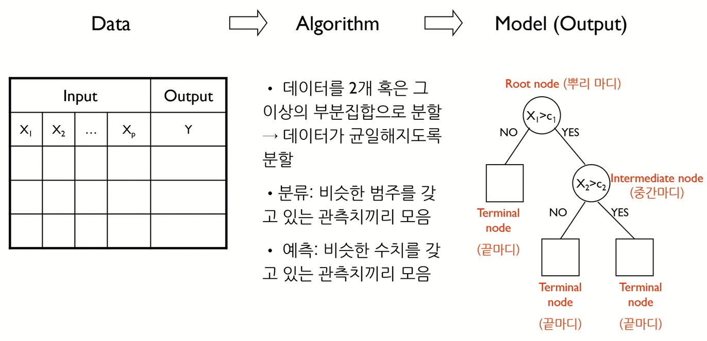
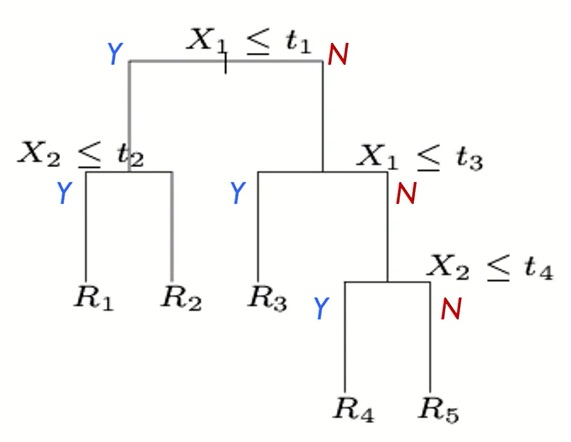
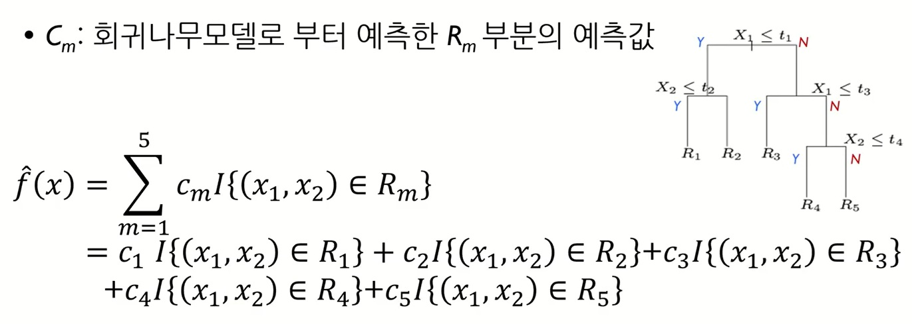
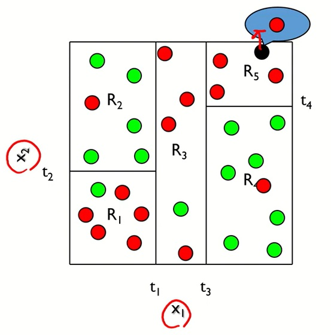
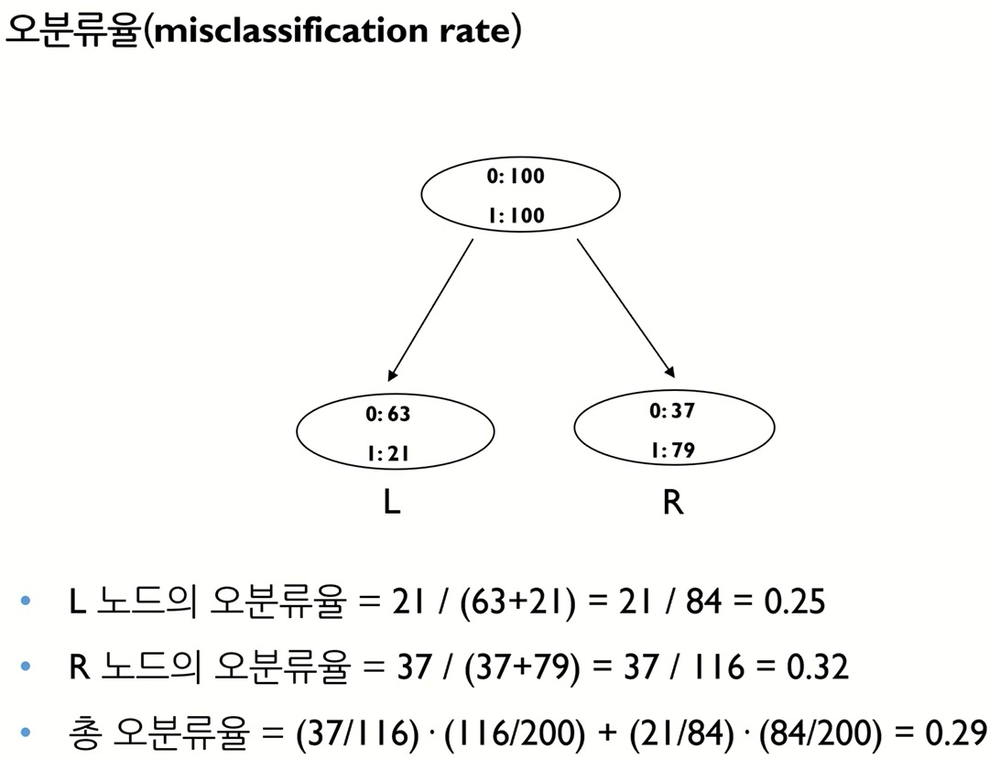
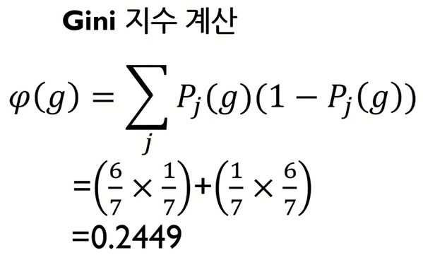
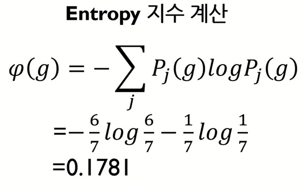

# ML 4주차 정규과제

📌ML 정규과제는 매주 정해진 **유튜브 강의 영상을 통해 머신러닝 이론을 학습**한 후, 해당 내용을 바탕으로 **실습 문제를 풀어보며 이해도를 높이는 학습 방식**입니다. 

이번주는 아래의 **ML_4th_TIL**에 명시된 유튜브 강의를 먼저 수강해 주세요. 학습 중에는 주요 개념을 스스로 정리하고, 이해가 어려운 부분은 강의 자료나 추가 자료를 참고해 보완해주세요. 과제까지 다 작성한 이후에 Github를 과제 시트에 제출해주시면 됩니다.


**(수행 인증샷은 필수입니다.)** 

> 주어진 과제를 다 한 이후, 인증샷이나 따로 코드를 깃허브에 정리하여 제출해주세요.


## ML_4th_TIL

### 의사결정나무모델 1 (모델 개요, 예측 나무)

### 의사결정나무모델 2 (분류 나무, Information Gain)

<br>


## 주차별 학습 (Study Schedule)

| 주차   | 공부 범위                              | 완료 여부 |
| ------ | -------------------------------------- | --------- |
| 1주차. | 선형 회귀 (Linear Regression) (1)      | ✅         |
| 2주차  | 선형 회귀 (Linear Regression) (2)      | ✅         |
| 3주차  | 로지스틱 회귀 (Logistic Regression)    | ✅         |
| 4주차  | 결정 트리 (Decision Tree)              | ✅         |
| 5주차  | 앙상블 : 랜덤 포레스트 (Random Forest) | 🍽️         |
| 6주차  | 주성분 분석 (PCA)                      | 🍽️         |
| 7주차  | K - 평균 군집화                        | 🍽️         |

<!-- 여기까진 그대로 둬 주세요-->


---

# 1️⃣ 개념 정리

## 01. 의사결정나무모델 1 (모델 개요, 예측 나무)

```
✅ 학습 목표 :
* 의사결정나무 (Decision Tree) 모델의 개념과 동작 방식을 이해할 수 있다.
* 예측나무 (Regression Tree)의 분할 방식과 예측 방법을 이해할 수 있다.
* 의사결정나무 모델의 데이터 분할 과정과 그 목적을 이해할 수 있다. 
```

### 01-1. 의사결정나무의 개념과 동작 방식

- 의사결정나무 모델이란?
  - 데이터에 내재되어 있는 패턴을 변수의 조합으로 나타내는 예측, 분류 모델을 나무의 형태로 만드는 것
  - 질문을 던져서 맞고 틀리는 것에 따라 우리가 생각하고 있는 대상을 좁혀나감
  - 스무고개 놀이와 비슷한 개념

- 개요

  

### 01-2. 예측나무(Regression Tree)의 분할 방식과 예측 방법

- 예측나무 모델

  
  


### 01-2*&nbsp;GPT 정리

#### 🌳 예측나무(Regression Tree)란?

* **트리 기반 모델**의 한 종류
* 데이터를 조건(분기점, threshold)으로 나누어가며, **구간별로 평균값(또는 예측값)** 을 출력
* 그림에서처럼 (X_1, X_2) 같은 변수를 임계값 (t_1, t_2,\dots) 기준으로 잘라서 리프노드(R1~R5)별 **평균값 (c_m)** 을 예측치로 사용

---

#### 🔧 Regression Tree는 언제 쓰는가?

* **연속형 변수(수치형 종속변수)** 를 예측할 때 사용

  * 예: 집값, 매출액, 체중 등 숫자 예측 문제
* 장점:

  * **비선형 관계**도 잘 설명 (직선 회귀처럼 직선에 갇히지 않음)
  * **해석이 직관적** (조건문 형태로 설명 가능)
* 단점:

  * 데이터가 조금만 바뀌어도 트리 구조가 크게 변함 (불안정성)
  * 과적합(Overfitting) 위험 → 가지치기(pruning) 필요

---

#### 📊 Regression Tree vs Decision Tree vs Random Forest

| 모델                  | 목적                     | 결과값                 | 특징                       |
| ------------------- | ---------------------- | ------------------- | ------------------------ |
| **Regression Tree** | **수치 예측**              | 평균값(연속형)            | 트리 구조로 조건별 예측            |
| **Decision Tree**   | **분류(Classification)** | 범주(label)           | 예: 스팸메일인지 아닌지            |
| **Random Forest**   | 분류 + 회귀 모두 가능          | - 분류: 다수결 - 회귀: 평균값 | 여러 개 트리를 앙상블 → 성능↑, 과적합↓ |

---

#### 💡 직관적 예시

* **Regression Tree**: "집값" 예측

  * 조건: 방 개수, 면적, 위치 등으로 나눔
  * 리프노드마다 평균 집값을 예측치로 반환
* **Decision Tree**: "합격/불합격" 분류
* **Random Forest**: 여러 트리를 묶어 집값 예측 평균을 내거나, 합격/불합격 다수결로 결정

---

👉 정리하면,

* **예측나무(Regression Tree)** = 연속형 값을 조건별로 나눠 평균값으로 예측
* **Decision Tree** = 분류용 (범주)
* **Random Forest** = 여러 트리를 묶어 일반화 성능을 높인 앙상블 모델

- 예측나무 모델링 프로세스
  - 데이터를 $M$개로 분할
  - 최상의 분할은 다음 비용함수(cost function)를 최소로 할 때 얻어짐.
  - 각 분할에 속해 있는 $y$갑들의 평균으로 예측했을 때 오류가 최소
$$
\min_{c_m} \sum_{i=1}^N \left( y_i - f(x_i) \right)^2
$$

$$
= \min_{c_m} \sum_{i=1}^N \left( y_i - \sum_{m=1}^M c_m I(x \in R_m) \right)^2
$$

$$
\hat{c}_m = ave(y_i \mid x_i \in R_m)
$$

- 분할변수 $(j)$와 분할점$(s)$은 어떻게 결정할까?
  - 


### 01-3. 의사결정나무 데이터 분할 과정과 목적 - GPT

#### 1️⃣ 데이터 분할 과정 (How?)

의사결정나무는 데이터를 반복적으로 **조건(Threshold)** 에 따라 잘라내며 학습합니다.

1. **모든 데이터에서 시작**

   * 루트 노드(root) 하나에 전체 데이터 포함

2. **분할 기준(Feature, Threshold) 선택**

   * 분류(Classification): 지니지수(Gini Index), 엔트로피(Entropy) → **불순도(Impurity) 최소화**
   * 회귀(Regression): MSE(평균제곱오차) → **분산(Variance) 최소화**

3. **데이터 분할 (Split)**

   * 선택된 변수 X와 임계값 t에 따라 두 개(or 여러 개)의 그룹으로 나눔

4. **반복 (재귀적 분할)**

   * 각 하위 노드에서도 동일한 절차 반복
   * stopping rule(중단 기준):

     * 노드 안 데이터가 너무 적음
     * 더 이상 분할로 성능 향상이 미미
     * 트리의 최대 깊이에 도달

5. **리프 노드(Leaf) 도착 → 예측값 할당**

   * 분류: 다수 클래스 (예: “Y/N 중 다수결”)
   * 회귀: 평균값

---

#### 2️⃣ 데이터 분할의 목적 (Why?)

* **데이터를 잘게 쪼개서 “순수한 그룹”을 만드는 것**
* 즉, 각 그룹이 최대한 **한 가지 클래스(분류)** 또는 **비슷한 값(회귀)** 을 가지도록 하는 것

👉 직관적으로는,
“데이터를 쪼갤수록 그룹 안의 데이터들이 **비슷비슷해져서** 예측이 쉬워진다.”

---

#### 3️⃣ 직관적 예시

* **분류 예시**: 고객 이탈 여부(Yes/No)

  * 분할 전: Yes=50%, No=50% → 예측 불확실
  * 분할 후: (나이 < 30) 그룹 → Yes=80%, No=20% → 더 예측 쉽다

* **회귀 예시**: 집값 예측

  * 분할 전: 다양한 집값(평균 5억, 분산 큼)
  * 분할 후: (평수 < 30) 그룹 → 평균 3억 (집값 비슷함) → 예측 오차 줄어듦

---

✅ 정리하면,

* **과정**: 데이터 → 불순도/분산이 최소가 되도록 변수와 임계값을 선택 → 반복 분할 → 리프 노드 예측
* **목적**: 각 노드가 **동질적(Homogeneous)** 이 되도록 만들어 예측 정확도를 높이는 것


<!-- 새롭게 배운 내용을 자유롭게 정리해주세요.-->


## 02. 의사결정나무모델 2 (분류 나무, Information Gain)

```
✅ 학습 목표 :
* 분류나무(Classification Tree) 모델의 구조와 동작 원리를 이해할 수 있다. 
* 불순도 지표(Gini, Cross-Entropy, Misclassification Rate)와 Information Gain의 개념을 이해할 수 있다.
* 분류나무 모델의 한계와 과적합 문제를 이해할 수 있다. 
```

### 02-1. 분류나무(Classification Tree)의 구조와 동작원리

- $y$가 실수(연속형)가 아닌, 범주형 값을 가지고 있을 때 활용하는 모델
  - 각 관측치 마다 반응변수 값 $ y_i = 1, 2, ... K $, 즉 $K$개의 클래스 존재
  - $ R_m $: 끝노드 $m$에 해당하며 $N_m$ 관측치 개수를 가지고 있음.
  - $\hat{p}_{mk} $: 끝노드 $m$에서 $k$ 클래스에 속해 있는 관측치의 비율
    > $ \hat{p}_{mk} = \frac{1}{N_m} \sum_{x_i \in R_m} I(y_i = k) $  
  - 끝노드 $m$으로 분류된 관측치는 $k(m)$ 클래스로 분류


  

### 02-1*&nbsp; 분류나무가 뭐야? - GPT

#### 🌳 분류나무(Classification Tree)의 위치

1. **의사결정나무(Decision Tree)**

   * 큰 틀의 이름 → 트리 구조로 의사결정을 하는 모든 모델 포함
   * 두 가지로 나뉨

     * **분류나무(Classification Tree)**: 종속변수가 **범주형(Y=Yes/No, Class1/Class2)**
     * **회귀나무(Regression Tree)**: 종속변수가 **연속형(Y=숫자, 가격, 점수)**

👉 즉, **분류나무는 의사결정나무의 한 종류**

---

2. **랜덤포레스트(Random Forest)**

   * 여러 개의 의사결정나무를 묶은 **앙상블(ensemble) 기법**
   * 내부에 들어가는 개별 나무가 **분류나무일 수도, 회귀나무일 수도 있음**
   * 따라서 분류 문제라면 → 랜덤포레스트(Classification Forest)는 **분류나무들의 집합**
   * 회귀 문제라면 → 랜덤포레스트(Regression Forest)는 **회귀나무들의 집합**

---

#### 📊 관계 구조 요약

* **의사결정나무(Decision Tree)**

  * ├─ **분류나무(Classification Tree)**
  * └─ **회귀나무(Regression Tree)**
* **랜덤포레스트(Random Forest)** = 위 나무들을 여러 개 모아 성능 강화

---

#### 💡 직관적 비유

* **의사결정나무**: 나무 1그루 (분류용/회귀용)
* **분류나무**: 의사결정나무 중 “Yes/No, 범주” 문제 푸는 나무
* **랜덤포레스트**: 나무 여러 그루를 모은 숲 (분류 문제면 분류나무 숲, 회귀 문제면 회귀나무 숲)

---

👉 따라서, **분류나무는 의사결정나무에 포함**되고,
**랜덤포레스트는 여러 분류나무/회귀나무를 합친 상위 모델**이에요.


### 02-2. 불순도 지표(Gini, Entropy, MR)와 IG의 개념

- 분류 모델에서의 비용함수(불순도 측정)
  - Misclassification rate
  - Gini Index
  - Cross-entropy

**Misclassification rate:**

$$
\frac{1}{N_m} \sum_{i \in R_m} I(y_i \neq k(m)) = 1 - \hat{p}_{(mk)m}
$$

---

**Gini Index:**

$$
\sum_{k \neq k'} \hat{p}_{mk} \hat{p}_{mk'} 
= \sum_{k=1}^K \hat{p}_{mk} (1 - \hat{p}_{mk})
$$

---

**Cross-entropy:**

$$
- \sum_{k=1}^K \hat{p}_{mk} \log \hat{p}_{mk}
$$


- 분할법칙
  - 분할변수와 분할기준은 목표변수의 분포를 가장 잘 구별해주는 쪽으로 정함
  - 목표변수의 분포를 잘 구별해주는 측도로 순수도(purity) 또는 불순도(impurity)를 정의
    - 예를 들어 클래스 0과 클래스 1의 비율이 45%와 55%인 노드는, 각 클래스의 비율이 90%와 10%인 마디에 비하여 순수도가 낮다(또는 불순도가 높다)라고 해석함
  - 각 노드에서 분할변수와 분할점의 설정은 불순도의 감소가 최대가 되도록 선택

- 불순도 지표 계산 예시

   
   
   


- IG(Information Gain)
  - 특정 변수를 사용했을 때 entropy의 감소량
  - 즉, entropy가 많이 감소한 경우, 획득한 정보의 가치가 크다고 할 수 있음.

**Information Gain (IG):**

$$
IG(parent, split) 
= Entropy(parent) 
- \sum_{j=1}^k \frac{N_j}{N} \, Entropy(child_j)
$$


### 02-3. 분류나무(Classification) 모델의 한계와 과적합 문제

- 개별 트리 모델의 단점
  - 계층적 구조로 인해 중간에 에러가 발생하면 다음 단계로 에러가 계속 전파
  - 학습 데이터의 미세한 변동에도 최종 결과 크게 영향
  - 적은 개수의 노이즈에도 크게 영향을 받음
  - 나무의 최종 노드 개수를 늘리면 과적합 위험

- 해결 방안: 랜덤 포레스트(Random Forest)


<!-- 새롭게 배운 내용을 자유롭게 정리해주세요.-->


<br>
<br>

---

# 2️⃣ 과제

> **와인 품질 데이터셋을 사용하여 레드 / 화이트 와인을 분류하는 결정 트리 모델을 만들어봅시다. `plot_tree`함수로 트리 구조를 시각화하고, 와인 종류를 구분하는 가장 중요한 상위 2개의 분기 규칙이 무엇인지 주피터 노트북을 통해 작성해보세요.**


~~~
과제 가이드
1. 데이터 불러오기 및 준비
- 와인 품질 데이터셋 사용
- 레드 / 화이트를 이진 분류로 설정한다. (예시) red = 0, white = 1

2. 모델 학습
- from sklearn.tree import DecisionTreeClassifier, plot_tree 라이브러리 사용
- model.fit(X_train, y_train)으로 학습을 한다. 

* 힌트
- 트리의 루트노드로부터 상위 2~3개의 분기가 가장 핵심적인 변수입니다.
~~~


<br>

### 🎉 수고하셨습니다.