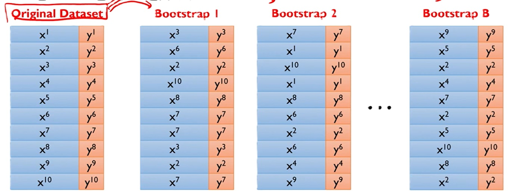
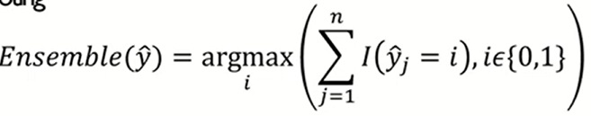
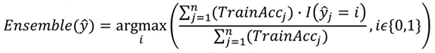
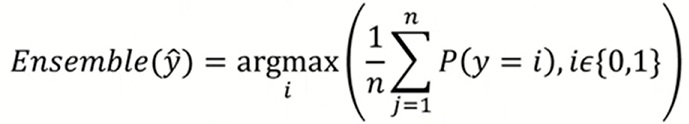

# ML 5주차 정규과제

📌ML 정규과제는 매주 정해진 **유튜브 강의 영상을 통해 머신러닝 이론을 학습**한 후, 해당 내용을 바탕으로 **실습 문제를 풀어보며 이해도를 높이는 학습 방식**입니다. 

이번주는 아래의 **ML_5th_TIL**에 명시된 유튜브 강의를 먼저 수강해 주세요. 학습 중에는 주요 개념을 스스로 정리하고, 이해가 어려운 부분은 강의 자료나 추가 자료를 참고해 보완해주세요. 과제까지 다 작성한 이후에 Github를 과제 시트에 제출해주시면 됩니다.


**(수행 인증샷은 필수입니다.)** 

> 주어진 과제를 다 한 이후, 인증샷이나 따로 코드를 깃허브에 정리하여 제출해주세요.


## ML_5th_TIL

### 랜덤포레스트 모델

<br>


## 주차별 학습 (Study Schedule)

| 주차   | 공부 범위                              | 완료 여부 |
| ------ | -------------------------------------- | --------- |
| 1주차. | 선형 회귀 (Linear Regression) (1)      | ✅         |
| 2주차  | 선형 회귀 (Linear Regression) (2)      | ✅         |
| 3주차  | 로지스틱 회귀 (Logistic Regression)    | ✅         |
| 4주차  | 결정 트리 (Decision Tree)              | ✅         |
| 5주차  | 앙상블 : 랜덤 포레스트 (Random Forest) | ✅         |
| 6주차  | 주성분 분석 (PCA)                      | 🍽️         |
| 7주차  | K - 평균 군집화                        | 🍽️         |

<!-- 여기까진 그대로 둬 주세요-->


---

# 1️⃣ 개념 정리

## 01. 랜덤포레스트 모델

```
✅ 학습 목표 :
* 랜덤 포레스트(Random Forest)의 개념과 필요성을 이해할 수 있다.
* Bagging과 Random Subspace의 원리와 역할을 이해할 수 있다.
* 랜덤 포레스트의 Generalization Error 개념을 이해할 수 있다.
* Out-of-Bag(OOB) Error와 변수 중요도 평가 방법을 이해할 수 있다.
* 랜덤 포레스트 모델의 주요 하이퍼파라미터를 이해하고 설정할 수 있다. 
```

<!-- 새롭게 배운 내용을 자유롭게 정리해주세요.-->

### 01-1. 랜덤 포레스트(Random Forest)의 개념과 필요성을 이해할 수 있다.

- 랜덤 포레스트의 필요성
  - 개별 트리 모델의 단점
    1. 계층적 구조로 인해 중간에 에러가 발생하면 다음 단계로 에러가 계속 전파
    1. 학습 데이터의 미세한 변동에도 최종 결과 크게 영향(적은 개수의 노이즈에도 크게 영향)
    1. 나무의 최종 노드 개수를 늘리면 과적합 위험(Low Bias, Large Variance)
  - 해결 방안: 랜덤 포레스트

- 랜덤 포레스트
  - 앙상블: 여러 Base 모델들의 다수결 법칙 또는 평균을 이용해 통합하여 예측 정확성을 향상시키는 방법
  - 다음 조건을 만족할 때, 앙상블 모델은 Base 모델보다 우수한 성능을 보여줌
    1. Base 모델들이 서로 독립적
    1. Base 모델들이 무작위 예측을 수행하는 모델보다 성능이 좋은 경우

### 01-1*&nbsp;GPT 정리<br> 

여기서 말하는 **Base 모델(Base Learner)** 은 바로 **개별 의사결정나무(Decision Tree)** 를 의미합니다.

---

#### 🌳 랜덤포레스트(Random Forest)의 구조 요약

| 구성요소                   | 설명                                        |
| ---------------------- | ----------------------------------------- |
| **Base Model (기저 모델)** | **여러 개의 Decision Tree** 각각을 의미            |
| **앙상블 방법**             | 여러 트리의 결과를 **평균(회귀)** 또는 **다수결(분류)** 로 통합 |
| **최종 예측값**             | 각 트리의 예측을 종합한 결과                          |

---

#### ⚙️ 학습 과정 간단히 보면

1. **Bootstrap Sampling**

   * 원본 데이터에서 **랜덤하게 일부 표본을 복원추출**하여 각 트리를 학습
   * → 트리마다 조금씩 다른 데이터를 학습하게 됨

2. **Feature Randomness (특성 랜덤성)**

   * 각 트리 분할 시, 모든 변수를 고려하지 않고 **일부 랜덤하게 선택된 변수들만 사용**
   * → 트리 간 **상관성(의존성)** 줄이기

3. **앙상블 (Ensemble)**

   * 분류 문제: **다수결 투표**
   * 회귀 문제: **평균값 계산**

---

#### 💡 왜 Base 모델이 독립적이어야 하나?

* 트리들이 서로 너무 비슷하면 (= 완전히 같은 데이터, 같은 변수 사용)
  → 예측도 비슷해서 **앙상블 효과가 줄어듦**
* 서로 다른 부분을 배운 트리들이 모이면
  → 개별 오류가 상쇄되어 **안정적이고 일반화 성능이 좋은 모델** 완성

---

👉 정리하면,

* 랜덤포레스트의 **Base 모델 = 여러 개의 의사결정나무** 🌲🌲🌲
* 트리 간의 **무작위성(randomness)** 덕분에 서로 독립성을 확보하고,
* 이를 **앙상블(평균/다수결)** 하여 더 강력한 예측 성능을 얻는 구조입니다.

- 앙상블 모델의 base모델 -> 의사결정나무모델
  - 의사결정나무모델은 앙상블 모델의 base 모델로써 활용도가 높음
  - Low computational complexity: 데이터의 크기가 방대한 겨우에도 모델을 빨리 구축할 수 있음
  - Nonparametric: 데이터의 분포에 대한 전제가 필요하지 않음(제한이 없음)

- 랜덤 포레스트 모델의 개요
  - 다수의 의사결정나무모델에 의한 예측을 종합하는 앙상블 방법
  - 일반적으로 하나의 의사결정나무모델보다 높은 예측력을 보여줌
  - 관측치 수에 비해 변수의 수가 많은 고차원 데이터에서 중요 변수 선택 기법으로 널리 활용됨

### 01-2. Bagging과 Random Subspace의 원리와 역할을 이해할 수 있다.

- 랜덤 포레스트의 핵심 아이디어: Diversity, Random 확보
  1. 여러 개의 Training data를 생성하여 각 데이터마다 개별 의사결정나무모델 구축 -> **Bagging**
  1. 개별 의사결정나무모델 구축 시 변수 무작위로 선택 -> **Random subspace**

- Bagging(Bootstrap Aggregating): 각각의 bootstrap 샘플로부터 생성된 모델을 합침
  - Bootstrapping
    - **복원추출**을 통해 원래 데이터의 수만큼의 크기를 갖도록 샘플링
    - 개별 데이터셋을 붓스트랩셋이라 부름
    - 복원추출이므로 특정 데이터가 여러 번 추출될수도, 한 번도 추출되지 않을 수도 있음.
    - 붓스트랩셋 내의 데이터 개수는 항상 동일해야 함.
    <br> 
  - Aggregating: 합치기
    - Majority voting
    <br> 
    - Weighted voting(weight=training accuracy of individual models)
    <br> 
    - Weighted voting(weight=predicted probability for each class)
    <br>
  
- Random subspace
  - 과정
    1. 원래 변수들 중에서 모델 구축에 쓰일 **입력 변수를 무작위로 선택**
    1. 선택된 입력 변수 중에 분할될 변수를 선택
    1. 이러한 과정을 full-grown tree가 될 때까지 반복
  - 의사결정나무의 분기점을 탐색할 때, 원래의 변수의 수보다 적은 수의 변수를 임의로 선택하여 해당 변수들만을 고려 대상으로 함.

- Generalization Error
  - 각각의 개별 tree는 과적합될 수 있음
  - Random forest는 tree 수가 충분히 많을 때 Strong Law of Large Numbers에 의해 과적합되지 않고 그 에러는 limiting value에 수렴됨.
  - Bagging과 Random subspace 기법은 각 모델들의 독립성, 일반화, 무작위성을 최대화시켜 모델간의 상관관계 $\rho$를 감소시킴
  - 개별 Tree의 정확도, 독립성이 높을수록 random forest의 성능이 높아짐.

### 01-3. Out-of-Bag(OOB) Error와 변수 중요도 평가 방법을 이해할 수 있다.

#### 🧩 1️⃣ Out-of-Bag (OOB) Error

| 항목            | 내용                                                                                  |
| ------------- | ----------------------------------------------------------------------------------- |
| **개념**        | 부트스트랩 샘플링 시, 각 트리 학습에 사용되지 않은 **데이터(Out-of-Bag)** 를 이용해 성능을 평가                      |
| **배경**        | 각 트리는 약 63%의 데이터만 사용 (나머지 37%는 OOB로 남음)                                             |
| **평가 방식**     | ① 각 데이터 포인트는 자신을 학습에 사용하지 않은 트리들의 예측값을 모음<br>② 이들의 다수결/평균으로 예측 → 실제값과 비교해 오차 계산     |
| **OOB Error** | 전체 데이터에 대해 위 과정을 반복하여 얻은 **평균 예측 오차**                                               |
| **장점**        | - 별도의 검증용 데이터(Validation set) 불필요<br>- 교차검증(CV)과 유사한 효과<br>- 훈련 중 내부적으로 일반화오차 추정 가능 |
| **한계**        | 데이터가 매우 작거나 불균형한 경우, OOB 성능이 불안정할 수 있음                                              |

---

#### 📊 2️⃣ 변수 중요도 (Feature Importance)

##### (1) **Mean Decrease in Impurity (MDI)**

| 항목         | 내용                                                     |
| ---------- | ------------------------------------------------------ |
| **개념**     | 각 변수가 트리에서 불순도를 얼마나 감소시켰는지 평균하여 측정                     |
| **불순도 지표** | Gini, Entropy 등                                        |
| **특징**     | 계산이 빠르고 기본적인 방법 (RandomForest의 `feature_importances_`) |
| **단점**     | - 범위가 넓은 변수에 편향될 수 있음<br>- 상호 관련 변수들 사이에서는 왜곡 가능       |

---

##### (2) **Permutation Importance (Mean Decrease Accuracy, MDA)**

| 항목     | 내용                                                                |
| ------ | ----------------------------------------------------------------- |
| **개념** | 특정 변수를 랜덤으로 섞어 예측 정확도 감소 정도를 측정                                   |
| **절차** | ① 원래 데이터로 예측 정확도 계산<br>② 특정 변수의 값을 섞고 다시 예측<br>③ 정확도 감소폭 → 변수 중요도 |
| **장점** | - 변수 간 상관관계 영향을 덜 받음<br>- 모델 전반적 성능에 미치는 영향 직접 평가 가능              |
| **단점** | - 계산량 많음<br>- 상호작용 변수 해석이 복잡해질 수 있음                               |

---

#### 🎯 3️⃣ 핵심 비교 요약

| 구분        | OOB Error                             | 변수 중요도        |
| --------- | ------------------------------------- | ------------- |
| **목적**    | 모델의 일반화 성능 추정                         | 각 변수의 영향력 평가  |
| **평가 대상** | 예측 결과 전체                              | 개별 변수         |
| **활용 시점** | 모델 학습 후 성능 검증                         | 모델 해석 및 피처 선택 |
| **공통점**   | 랜덤포레스트의 **내부 검증 지표**, 별도 검증 데이터 필요 없음 |               |

---

✅ **정리**

* **OOB Error** → 랜덤포레스트의 “내부 교차검증 오차”
* **변수 중요도** → 모델이 어떤 변수를 가장 많이 활용했는지 평가


### 01-4. 랜덤 포레스트 모델의 주요 하이퍼파라미터를 이해하고 설정할 수 있다

좋아요 👍
이번엔 **랜덤 포레스트(Random Forest)의 주요 하이퍼파라미터**들을
역할·영향·권장 설정 방식 중심으로 **표 정리 + 요약 설명**으로 정리해드릴게요 👇

---

#### 🌲 랜덤 포레스트 주요 하이퍼파라미터 정리

---

##### 🔧 1️⃣ 모델 구조 관련

| 하이퍼파라미터               | 설명                  | 영향 / 역할                                                                    | 권장 설정                   |
| --------------------- | ------------------- | -------------------------------------------------------------------------- | ----------------------- |
| **n_estimators**      | 트리(Tree)의 개수        | 트리 수가 많을수록 안정적이지만 계산량 증가                                                   | 기본: 100~300 / 성능 중요 시 ↑ |
| **criterion**         | 분할 기준               | 분류: `"gini"` 또는 `"entropy"`<br>회귀: `"squared_error"` 또는 `"absolute_error"` | 기본값 사용 무방               |
| **max_depth**         | 트리의 최대 깊이           | 깊을수록 학습 데이터에 과적합, 얕을수록 단순 모델                                               | 과적합 시 제한 (예: 10~30)     |
| **min_samples_split** | 분할을 수행하기 위한 최소 샘플 수 | 작으면 세분화↑ → 과적합<br>크면 일반화↑                                                  | 기본 2 → 5~10 정도로 조정 가능   |
| **min_samples_leaf**  | 리프 노드에 필요한 최소 샘플 수  | 너무 작으면 잡음에 민감                                                              | 1~5 정도가 보통              |
| **max_leaf_nodes**    | 리프 노드의 최대 개수        | 모델 복잡도 직접 제어                                                               | 필요 시 제한 가능              |

---

##### 🌿 2️⃣ 무작위성(Randomness) 관련

| 하이퍼파라미터          | 설명                        | 영향 / 역할                | 권장 설정                                        |
| ---------------- | ------------------------- | ---------------------- | -------------------------------------------- |
| **max_features** | 각 트리 분할 시 고려할 변수 개수       | 작을수록 트리 간 다양성↑ → 일반화↑  | 분류: `sqrt(n_features)`<br>회귀: `n_features/3` |
| **bootstrap**    | 부트스트랩 샘플링 여부 (True/False) | True → OOB Error 계산 가능 | 일반적으로 True                                   |
| **random_state** | 난수 고정용 시드(seed)           | 재현성 확보                 | 실험 시 반드시 지정                                  |

---

##### 🧠 3️⃣ 학습 제어 및 성능 관련

| 하이퍼파라미터          | 설명              | 영향 / 역할                | 권장 설정                 |
| ---------------- | --------------- | ---------------------- | --------------------- |
| **n_jobs**       | 병렬 처리 코어 수      | 병렬 학습 속도 향상            | `-1` → 모든 CPU 코어 사용   |
| **class_weight** | 클래스 불균형 조정      | 불균형 데이터에서 각 클래스 가중치 부여 | `"balanced"` 옵션 활용    |
| **oob_score**    | OOB Error 계산 여부 | 내부 검증 점수 확인            | `True` 설정 시 OOB 성능 출력 |

---

##### ⚙️ 4️⃣ 핵심 하이퍼파라미터 요약 포인트

| 구분         | 과적합 방지 관련                                                | 성능 향상 관련 |
| ---------- | -------------------------------------------------------- | -------- |
| **과적합 방지** | `max_depth`, `min_samples_leaf`, `max_leaf_nodes`        |          |
| **성능 향상**  | `n_estimators`, `max_features`, `bootstrap`, `oob_score` |          |

---

##### 🎯 정리

* **랜덤포레스트는 “많은 나무 + 랜덤성”으로 일반화 성능을 높이는 모델**
* 하이퍼파라미터 조정은

  * 트리의 **수와 깊이**로 복잡도 제어,
  * **랜덤성(max_features, bootstrap)** 으로 다양성 확보,
  * **OOB Error** 로 성능 검증

<br>
<br>

---

# 2️⃣ 과제

> **4주차에 진행했던 와인 품질 데이터셋에 대해 랜덤 포레스트 모델을 적용해봅시다. `feature_importances`속성을 추출하여 어떤 변수들이 와인 품질 예측에 가장 중요한 역할을 하는지 시각화(막대 그래프)하고, 이번에는 상위 3개의 변수에 대해 설명하는 주피터 노트북을 작성해주세요.**


~~~
과제 가이드
1. 모델 학습
- 4주차에 사용한 와인 품질 데이터셋 재활용
- from sklearn.ensemble import RandomForestClassifier
- model.fit(X_train, y_train)으로 학습을 한다. 
- feature_importance 를 분석하여, 어떤 변수가 예측에 중요한 역할을 하는지 해석한다. 

* 힌트
- feature_importance란.? : 랜덤포레스트는 어떤 변수가 분할 시 예측 성능에 향상에 기여했는지를 평가한다.
- 즉 값이 클수록 중요하다. 
~~~


<br>

### 🎉 수고하셨습니다.