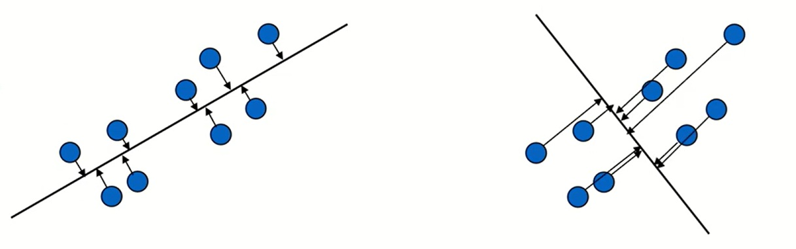

# ML 6주차 정규과제

📌ML 정규과제는 매주 정해진 **유튜브 강의 영상을 통해 머신러닝 이론을 학습**한 후, 해당 내용을 바탕으로 **실습 문제를 풀어보며 이해도를 높이는 학습 방식**입니다. 

이번주는 아래의 **ML_6th_TIL**에 명시된 유튜브 강의를 먼저 수강해 주세요. 학습 중에는 주요 개념을 스스로 정리하고, 이해가 어려운 부분은 강의 자료나 추가 자료를 참고해 보완해주세요. 과제까지 다 작성한 이후에 Github를 과제 시트에 제출해주시면 됩니다.


**(수행 인증샷은 필수입니다.)** 

> 주어진 과제를 다 한 이후, 인증샷이나 따로 코드를 깃허브에 정리하여 제출해주세요.


## ML_6th_TIL

### Principal Component Analysis(PCA, 주성분 분석)

<br>


## 주차별 학습 (Study Schedule)

| 주차  | 공부 범위                              | 완료 여부 |
| ----- | -------------------------------------- | --------- |
| 1주차 | 선형 회귀 (Linear Regression) (1)      | ✅         |
| 2주차 | 선형 회귀 (Linear Regression) (2)      | ✅         |
| 3주차 | 로지스틱 회귀 (Logistic Regression)    | ✅         |
| 4주차 | 결정 트리 (Decision Tree)              | ✅         |
| 5주차 | 앙상블 : 랜덤 포레스트 (Random Forest) | ✅         |
| 6주차 | 주성분 분석 (PCA)                      | ✅         |
| 7주차 | K - 평균 군집화                        | 🍽️         |

<!-- 여기까진 그대로 둬 주세요-->


---

# 1️⃣ 개념 정리

## 01. Principal Component Analysis(PCA, 주성분 분석)

```
✅ 학습 목표 :
* PCA(주성분 분석)의 필요성과 목적을 이해할 수 있다.
* 변수 선택과 변수 추출의 차이를 이해하고, PCA가 변수 추출 방식임을 이해할 수 있다.
* PCA의 수학적 원리(공분산 행렬, 고유값/고유벡터, 사영)를 이해할 수 있다.
* PCA 알고리즘의 절차를 이해하고 설명할 수 있다.
* PCA의 한계와 대안 기법을 이해할 수 있다. 
```

<!-- 새롭게 배운 내용을 자유롭게 정리해주세요.-->

### 1. PCA(주성분 분석)의 필요성과 목적을 이해할 수 있다.

- 고차원 데이터
  - 변수의 수가 많음 -> 불필요한 변수 존재
  - 시각적으로 표현하기 어려움
  - 계산 복잡도 증가 -> 모델링 비효율적

- 따라서 중요한 변수만을 선택하여 차원을 축소하는 과정이 필요함.

### 2. 변수 선택과 변수 추출의 차이를 이해하고, PCA가 변수 추출 방식임을 이해할 수 있다.

- 변수 선택(selection): 분석 목적에 부합하는 소수의 예측변수만을 선택
  - 장점: 선택한 변수 해석 용이
  - 단점: 변수간 상관관계 고려 어려움

- 변수 추출(extraction): 예측변수의 변환을 통해 새로운 변수 추출
  - 장점: 변수간 상관관계 고려, 일반적으로 변수의 개수를 많이 줄일 수 있음
  - 단점: 추출된 변수의 해석이 어려움

- 변수 선택/추출을 통한 차원 축소
  - Supervised feature selection: Information gain, Stepwise regression, LASSO, Genetic Algorithm
  - Supervised feature extraction: Partial least squares(PLS)
  - Unsupervised feature selection: PCA loadinbg
  - Unsupervised featrue extraction: **Principal component analysis(PCA)**


### 3. PCA의 수학적 원리(공분산 행렬, 고유값/고유벡터, 사영)를 이해할 수 있다.

- PCA 개요(1)
  - 고차원 데이터를 효과적으로 분석하기 위한 대표적 분석 기법
  - 차원축소, 시각화, 군집화, 압축
  - 활용 데이터: 이미지 데이터, Signal data, Network data, Text data

- PCA 개요(2)
  - PCA는 $n$개의 관측치와 $p$개의 변수로 구성된 데이터를 상관관계가 없는 $k$개의 변수로 구성된 데이터($n$개의 관측치)로 요약하는 방식. 이때 요약된 변수는 기존 변수의 선형조합으로 생성됨
  - 원래 데이터의 분산을 최대한 보존하는 새로운 축을 찾고, 그 축에 데이터를 사영(Proejection)시키는 기법
  - 주요 목적
    - 데이터 차원 축소
    - 데이터 시각화 및 해석
    - 일반적으로 전체 분석 과정 중 초기에 사용


### 4. PCA 알고리즘의 절차를 이해하고 설명할 수 있다.

- 주성분 분석
  - 아래 2차원 데이터를 좌측과 우측 두 개의 축에 사영시킬 경우 좌측 기저(bias)가 우측 기저에 손실되는 정보의 양(분산의 크기)이 적으므로 상대적으로 선호되는 기저라고 할 수 있음.
  <br> 

- 관련 개념
  - 사영(Projection)<br>: 한 벡터 b를 다른 벡터 a에 사영시킨다는 것은 벡터 b로부터 벡터 a에 수직인 점까지의 길이를 가지며 벡터 a와 같은 방향을 갖는 벡터를 찾는다는 것을 의미
  - 데이터 정규화: 모든 변수의 평균을 0으로 맞춤

- 몇 개의 주성분을 사용해야 할까? - 선택 방식
  1. 고유값 감소율이 유의미하게 낮아지는 Elbow Point에 해당하는 주성분 수를 선택
  1. 일정 수준 이상의 분산비를 보존하는 최소의 주성분을 선택(보통 70% 이상)

- 절차 정리
  1. 데이터 정규화(mean centering)
  1. 기존 변수의  covariance(correlation) matrix 계산
  1. Covariance(correlation) matrix로부터 eigenvalue 및 이에 해당되는 eigenvector를 계산
  1. Eigenvalue 및 해당되는 eigenvectors를 순서대로 나열
  1. 정렬된 eigenvector를 토대로 기존 변수를 변환

### 5. PCA의 한계와 대안 기법을 이해할 수 있다. 

- 한계
  1. 데이터의 분포가 가우시안이 아니거나 다중 가우시안 자료들에 대해서는 적용하기가 어려움
    - 대안: 커널 PCA, LLE(Locally Linear Embedding)
  2. 분류/예측 문제에 대해서 데이터의 범주 정보를 고려하지 않기 때문에 범주간 구분이 잘 되도록 변환을 해 주는 것은 아님(주성분분석은 단순히 변화된 축이 최대 분산방향과 정렬되도록 좌표회전을 수행함)
    - 대안: Partial Least Squre(PLS)


<br>
<br>

---

# 2️⃣ 과제

> **`Scikit-learn`의 손글씨 숫자(digits) 데이터셋을 로드합니다. 원본 데이터는 64개의 변수(8 X 8 픽셀)을 가집니다. PCA를 적용하여 데이터를 2개의 주성분으로 축소하고, 2차원 평면에 각 숫자가 어떻게 분포하는지 산점도로 시각화합니다. 첫 2개의 주성분이 전체 데이터 분산의 몇 %를 설명하는지 확인하고, 그 의미를 주피터 노트북에 서술하세요.**


~~~
과제 가이드
1. 데이터 로드
- from sklearn.datasets import load_digits 을 통해 불러오세요.

2. PCA 적용
- from sklearn.decomposition import PCA 라이브러리를 사용하시면 됩니다. 
- 예시) pca = PCA(n_components = k) 와 같이 사용하면 됩니다. 

3. 분석 설명
- print(f'PC1: {explained_var_ratio[0]:.2%}, PC2: {explained_var_ratio[1]:.2%}') 
- 첫 2개의 중성분이 전체 분산의 몇 %를 설명하는지 확인하기 

* 분석 포인트 
- 산점도를 해석하기 
- 분산 설명력을 해석하기 
	* PCA는 최대 분산 방향을 찾지만 분류 목적이 아닙니다. 
	* 고차원의 복잡한 구조를 단순화해서 보여주는 것입니다. 
~~~


<br>

### 🎉 수고하셨습니다.